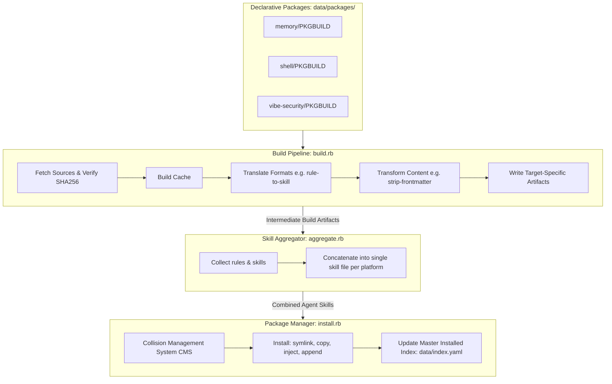

# Rulepack — Developer Guide

> **For users**: See [README.md](README.md) for quick start, commands, platform reference, and environment variables.

---

## 📖 Project Overview

This repository implements a **Single Source of Truth (SSOT)** management system for agent rules, skills, and documentation using a **declarative, package-based architecture** inspired by Arch Linux's `pacman` and `makepkg` package ecosystem. 

Each rule or skill exists as a package with a declarative descriptor (`PKGBUILD`). The system downloads, validates, translates, transforms, and installs files into target agent platforms using a robust transaction, drift-verification, and repair pipeline.

**Core Purpose**: Maintain a single, canonical repository of agent instructions. Automatically propagate updates, convert formats on the fly, protect files against collision, and continuously reconcile the installed state on all local coding agents.

---

## 🗺️ Quick Links — Developer Docs

- **[Architecture](docs/agents/ARCHITECTURE.md)** — Core design patterns, pipeline flow, and data storage.
- **[Platforms](docs/agents/PLATFORMS.md)** — Registry of all 14 supported coding agents and platform constraints.
- **[Reference](docs/agents/REFERENCE.md)** — YAML PKGBUILD grammar, custom transformer API, and index schemas.
- **[Transforms](docs/agents/TRANSFORMS.md)** — Mechanics of built-in translation layers and custom translators.
- **[Upstream](docs/agents/UPSTREAM.md)** — Management of third-party git/url dependencies and version bumps.
- **[Usage](docs/agents/USAGE.md)** — Command-line interface references, arguments, and return codes.

---

## 📐 Architecture & Pipeline Flow



### Key Lifecycle Phases

1. **Build (`build.rb`)**: Loads YAML descriptors from `data/packages/`. Downloads and caches remote assets (URL/git) inside a content-addressed directory, verifying integrity via SHA256. Translates content formats, executes custom Ruby filters, generates platform-specific output files under `build/`, and writes the build index (`build/index.yaml`).
2. **Aggregate (`aggregate.rb`)**: Merges multiple rule fragments and common skills into single-file "skills" for platforms like Crush, Goose, Codex, and Droid, storing results under `build/<agent>/skills/vendor/`.
3. **Install (`install.rb`)**: Installs rules to active platform directories using symlinks, direct copies, config injections, or marker-based boundaries. Supports transaction safety via automatic backup generation and strict collision strategies. Updates the local installed database (`data/index.yaml`).
4. **Uninstall (`uninstall.rb`)**: Performs surgical, marker-aware uninstallation to restore files to their pre-installation state, gracefully removing lines or files and updating the database state.
5. **Verify & Fix (`verify.rb` & `fix.rb`)**: Runs live reconciliation of the filesystem against the master database, flagging modified, deleted, or missing package assets, and providing automatic drift repair.

---

## 🛠️ Pacman & makepkg Mimicry: Assessment of Success

Our core architectural blueprint is to **mimic the declarative simplicity and extreme robustness of Arch Linux's packaging ecosystem (`pacman` and `makepkg`)**. 

Below is an objective assessment of our mimicry model, highlighting exact parallels, successes, and future opportunities:

| Arch Linux Model | Rulepack Parallel | Assessment & Success Rate | Mechanics |
| :--- | :--- | :--- | :--- |
| **PKGBUILD (Bash Script)** | **`PKGBUILD` (YAML Descriptor)** | **9/10 (High)** | Arch uses shell scripts, which are flexible but insecure. We successfully adapted this into a safe, parser-friendly YAML schema while retaining exact metadata conventions (`pkgname`, `pkgver`, `pkgrel`, `epoch`, `order`, `arch`). |
| **`makepkg` (Build Tool)** | **`build.rb` (Build Engine)** | **9.5/10 (Extremely High)** | It fetches source archives (type `git`, `url`, `local`), validates SHA256 check-sums, uses a local content-addressed source cache, compiles files into target formats, and records an intermediate compilation manifest (`build/index.yaml`). |
| **`pacman -S` (Install)** | **`install.rb` (Package Manager)** | **9/10 (High)** | Injects rule files to paths, creates symlinks, and maintains an atomic master database (`data/index.yaml`) analogous to `/var/lib/pacman/local/`. Includes automated backup safety and transaction rollbacks. |
| **`pacman -R` (Uninstall)** | **`uninstall.rb` (Surgical Removal)** | **9.5/10 (Extremely High)** | Recursively uninstalls platform rules, handles dependencies (virtual `provides`), performs marker-aware, clean file-splicing, and updates the local state atomically. |
| **`pacman -Qk` (Verify)** | **`verify.rb` & `fix.rb` (Drift CMS)** | **10/10 (Perfect)** | Performs full SHA256 integrity audits on installed rule/skill files. Automatically identifies deleted, altered, or corrupted assets on disk, offering a self-healing `fix` command to repair the installation. |
| **`libalpm` Versioning** | **`vercmp` algorithm (Ruby)** | **10/10 (Perfect)** | Fully implements Arch Linux's strict `epoch:pkgver-pkgrel` vercmp specifications, handling alphanumeric release suffixes, decimal segment comparisons, and epoch priority overrides. |

### Major Strengths of Our Mimicry
* **No External Dependencies**: Built strictly using Ruby's core standard library. Run it on any environment without gem bloat.
* **Surgical State Integrity**: Traditional package managers replace whole files. We adapted the concept to handle *live text files*, meaning we can surgically install rules into a shared `cli_config.yaml` or `.bashrc` using marker comments (`# Rulepack Start`, `# Rulepack End`) and roll them back flawlessly.
* **Self-Healing Architecture**: We don't just hope the packages remain in place. Running `bin/rulepack verify` detects if the user accidentally edited or deleted a symlinked/copied rule, and `bin/rulepack fix` automatically restores it from compilation cache.

---

## 🛠️ CLI Command Reference

Rulepack commands are wrapped inside `bin/rulepack` for convenience. Under the hood, they map to highly optimized Ruby libraries.

```bash
# Compilation & Packaging
bin/rulepack build                            # Compiles packages to build/

# Platform Deployment (Install)
bin/rulepack install <platform>               # Installs all packages targeting platform
bin/rulepack install <platform> --select      # Interactive selection menu for sub-skills
bin/rulepack install <platform> --dry-run     # Preview changes without modifying files
bin/rulepack install <platform> --force       # Force install, bypassing state constraints

# Collision Management (Install option)
bin/rulepack install <platform> --on-collision stop       # (Default) Halts and reports collision
bin/rulepack install <platform> --on-collision ignore     # Skips conflicting files and continues
bin/rulepack install <platform> --on-collision overwrite  # Replaces existing files, creating a backup
bin/rulepack install <platform> --on-collision append     # Appends rules using surgical boundary markers

# Maintenance & Reconciliation
bin/rulepack check <platform>                 # Checks which packages are built/installed
bin/rulepack verify <platform>                # Performs live disk integrity and drift audit
bin/rulepack fix <platform>                   # Automatically repairs modified or missing files
bin/rulepack uninstall <platform>             # Surgically removes rules/skills for target
bin/rulepack query <search_term>              # Query package meta database
```

---

## 📁 Package Scope & Path Resolution Rules

Installation paths resolve dynamically based on **Scope** (defined in `data/registry/platforms.yaml`):

### 1. User-Scoped Platforms (Global)
* **Scope**: `user`
* **Behavior**: Installed globally in the user's home folder.
* **Resolution**: Uses the home folder base path (e.g. `~/.config/gemini/`).
* **Defaults**: Running `bin/rulepack install` (without specifying a platform) will **automatically detect and install to all supported, globally installed user-scoped platforms** on the current system, giving you an instantaneous, zero-configuration sync.

### 2. Project-Scoped Platforms (Local)
* **Scope**: `project`
* **Behavior**: Installed inside the active project directory.
* **Resolution**: Searches the active directory tree for target agent rules (e.g. `.cursorrules`, `.windsurfrules`).
* **Fallback**: If a project-scoped platform is run outside an active workspace, it gracefully falls back to a global user configuration path or alerts the user, avoiding directory leakage or bad installations.

---

## 📦 Writing a PKGBUILD Descriptor

Create `data/packages/<pkgname>/PKGBUILD` (YAML). Below is the complete, canonical schema.

> [!IMPORTANT]
> **🤖 LLM / AI AGENT INSTRUCTION**: When asked to create a PKGBUILD:
> 1. You **MUST** include targets for **ALL** 14 supported platforms (`opencode`, `cursor`, `windsurf`, `claude-code`, `antigravity`, `oh-my-pi`, `crush`, `goose`, `droid`, `gemini-cli`, `qwen-code`, `codex`, `github-copilot`, `agents`).
> 2. **SCHEMA-DRIVEN ENGINE**: The build engine dynamically applies schema constraints (e.g. `frontmatter: strip`, `emoji_policy: strip`) based on `data/platforms/<agent>.yaml`. Therefore, you do **NOT** need to manually specify `transformer: strip-frontmatter` if the platform schema already declares it.
> 3. **DYNAMIC TRANSLATORS**: Before adding a new platform or complex format conversion, actively read the `data/platforms/<agent>.yaml` schema. If a complex structural change is required that the SchemaEngine does not support out-of-the-box, you **MUST** write a custom Ruby script under `data/translators/` and map it via `translate: custom:data/translators/your_script.rb`.

```yaml
---
pkgname: memory-management
pkgver: '1.2.0'
pkgrel: 1
epoch: 0
pkgdesc: Authoritative system rule governing coding agent memory retention and updates
arch: any
order: 10

source:
  - type: local
    path: src/memory.md
  # Alternatively, fetch remote source:
  # - type: url
  #   url: https://raw.githubusercontent.com/owner/repo/main/memory.md
  #   sha256: "d68c92a628a8d6e9f1a238bc321c89f5..."

targets:
  - platform: opencode
    format: directory
    output: 00-memory.md
    transformer: copy
    install:
      type: symlink
  - platform: cursor
    format: directory
    output: 00-memory.md
    transformer: strip-frontmatter
    install:
      type: symlink
  - platform: gemini-cli
    format: import
    output: memory-rule.md
    transformer: strip-frontmatter
    install:
      type: inject
  - platform: crush
    format: skill
    output: memory.md
    transformer: custom:transformers/rule_to_skill.rb
    install:
      type: copy
  # ... (include all other targets here)

tags:
  - rules
  - memory
maintainer: Antigravity AI
license: MIT
```

---

## 🧪 Testing & Code Conventions

All contributions must pass the absolute quality threshold before integration:

* **Strict Subprocess Elimination**: We do not spawn subshells. All internal scripts are executed using direct, memory-isolated Ruby `load()` processes, maintaining environment integrity.
* **Immutable Strings**: Every file must declare `# frozen_string_literal: true` at the top.
* **Pathname API**: Use the object-oriented `Pathname` class for all file operations—avoid flat string concatenation for directories.
* **Run Tests**:
  ```bash
  rake test
  ```
  Ensure all unit, integration, cache, installation, and end-to-end (E2E) verification assertions pass cleanly (0 errors, 0 failures).
