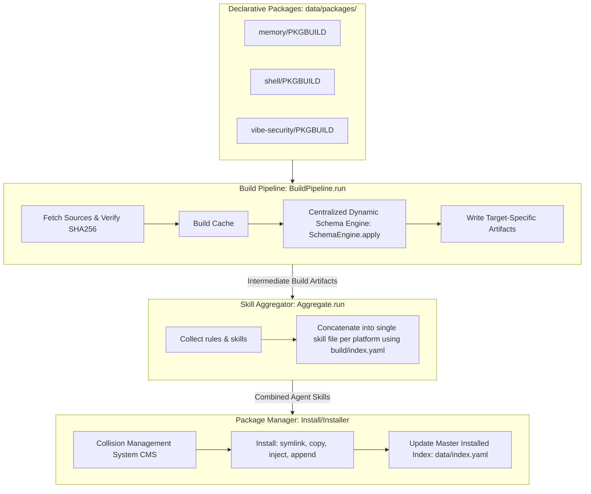

# Rulepack — Developer Guide

> **For users**: See [README.md](README.md) for quick start, commands, platform reference, and environment variables.

---

## 📖 Project Overview

This repository implements a **Single Source of Truth (SSOT)** management system for agent rules, skills, and documentation using a **declarative, package-based architecture** inspired by Arch Linux's `pacman` and `makepkg` package ecosystem.

Each rule or skill exists as a package with a declarative descriptor (`PKGBUILD`). The system downloads, validates, translates, transforms, and installs files into target agent platforms using a robust transaction, drift-verification, and repair pipeline.

**Core Purpose**: Maintain a single, canonical repository of agent instructions. Automatically propagate updates, convert formats on the fly, protect files against collision, and continuously reconcile the installed state on all local coding agents.

---

## 🗺️ Quick Links — Developer Docs

- **[Architecture](docs/agents/ARCHITECTURE.md)** — Core design patterns, pipeline flow, and data storage.
- **[Platforms](docs/agents/PLATFORMS.md)** — Registry of all 14 supported coding agents and platform constraints.
- **[Reference](docs/agents/REFERENCE.md)** — YAML PKGBUILD grammar, custom transformer API, and index schemas.
- **[Transforms](docs/agents/TRANSFORMS.md)** — Mechanics of built-in translation layers and custom translators.
- **[Upstream](docs/agents/UPSTREAM.md)** — Management of third-party git/url dependencies and version bumps.
- **[Usage](docs/agents/USAGE.md)** — Command-line interface references, arguments, and return codes.

---

## 📐 Architecture & Pipeline Flow



### Key Lifecycle Phases (Fully Modularized)

1. **Build (`Rulepack::Build` & `Rulepack::BuildPipeline`)**: Loads YAML descriptors from `data/packages/`. Downloads and caches remote assets (URL/git) inside a content-addressed directory, verifying integrity via SHA256. Executes a 4-stage sequential build pipeline (Fetch → Auto-derive Translator → Dynamic Schema Engine → Transformer), writing target-specific outputs under `build/`, and saving target metadata to the build index (`build/index.yaml`). Formatting concerns are centrally derived and executed by the Dynamic Schema Engine.
2. **Aggregate (`Rulepack::Aggregate`)**: Merges multiple rule fragments and common skills into single-file "skills" for platforms like Crush, Goose, Codex, and Droid, reading platform-specific target configurations from `build/index.yaml` and storing results under `build/<agent>/skills/vendor/`.
3. **Install (`Rulepack::Installer`)**: Installs rules to active platform directories using symlinks, direct copies, config injections, or marker-based boundaries. Supports transaction safety via automatic backup generation and strict collision strategies. Updates the local installed database (`data/index.yaml`).
4. **Uninstall (`Rulepack::Uninstaller`)**: Performs surgical, marker-aware uninstallation to restore files to their pre-installation state, gracefully removing lines or files and updating the database state.
5. **Verify & Fix (`Rulepack::Verify` & `Rulepack::Fix`)**: Runs live reconciliation of the filesystem against the master database, flagging modified, deleted, or missing package assets, and providing automatic drift repair.

---

## 🧱 Modular Architecture & Code Quality

To maintain optimal code health and prevent god-object clutter, the installer and E2E scripts are partitioned into highly specialized modules under [lib/rulepack/](lib/rulepack/) (32 .rb files across main and lib subdirectories):

### Facade Pattern — `common.rb` → Submodule Delegation

`common.rb` is a thin facade (70 LOC). It exposes no business logic of its own — instead it uses `Module#methods(false)` to enumerate each submodule's public API and re-exports it via `define_singleton_method` loops:

```ruby
Logging.methods(false).each { |m| define_singleton_method(m, &Logging.method(m)) }
IO.methods(false).each { |m| define_singleton_method(m, &IO.method(m)) }
# ... Validation, Path, InstallHelpers
```

This guarantees **100% backward compatibility**: all `Rulepack::Common.xxx` call sites continue to work transparently, while the real implementation lives in the submodule. The submodules were extracted incrementally in 7 phases (Phases 1–7), each verified by the full test suite.

### God Object Decomposition
*   **[transaction.rb](lib/rulepack/lib/transaction.rb)**: Manages atomic transaction logs, backups, and safe directory rollbacks.
*   **[install_handlers.rb](lib/rulepack/lib/install_handlers.rb)**: Coordinates low-level copy, symlink, and injection/append routines (marker-aware splicing).
*   **[skill_bundle.rb](lib/rulepack/lib/skill_bundle.rb)**: Resolves complex directory skill-bundles, selectively caching sub-skills and parsing manifests.
*   **[tui_selector.rb](lib/rulepack/lib/tui_selector.rb)**: Handles terminal keyboard inputs, formatted menu draws, and multi-selection prompts.
*   **[build_pipeline.rb](lib/rulepack/build_pipeline.rb)**: Orchestrates sequential build stage progression (:fetch → :translate → :schema_engine → :transform) and stage-transition validations.
*   **[schema_engine.rb](lib/rulepack/schema_engine.rb)**: Centralized Dynamic Schema Engine that normalizes document structure (YAML frontmatter, emoji policies, ATX heading style, dash bullets) using platform mappings.

### Programmatic Modules (Call-Aware)
All procedural pipeline components (`build.rb`, `verify.rb`, `fix.rb`, `aggregate.rb`) are wrapped inside namespaces (e.g. `Rulepack::Build`). They use caller-aware runner hooks at their bottom margins, allowing them to run programmatically when required, or as standalone executables from the CLI without side effects.

### Command Line Parsing Unification
*   **[cli_parser.rb](lib/rulepack/cli_parser.rb)**: Implements `Rulepack::CliParser`, unifying `ARGV` parsing, pacman flag conversions (`-S`, `-R`, `-Qk`, `-F`), selective configurations, and project scopes under a single robust interface.

---

## 🛠️ Pacman & makepkg Mimicry: Assessment of Success

Our core architectural blueprint is to **mimic the declarative simplicity and extreme robustness of Arch Linux's packaging ecosystem (`pacman` and `makepkg`)**.

Below is an objective assessment of our mimicry model, highlighting exact parallels, successes, and future opportunities:

| Arch Linux Model | Rulepack Parallel | Assessment & Success Rate | Mechanics |
| :--- | :--- | :--- | :--- |
| **PKGBUILD (Bash Script)** | **`PKGBUILD` (YAML Descriptor)** | **9/10 (High)** | Arch uses shell scripts, which are flexible but insecure. We successfully adapted this into a safe, parser-friendly YAML schema while retaining exact metadata conventions (`pkgname`, `pkgver`, `pkgrel`, `epoch`, `order`, `arch`). |
| **`makepkg` (Build Tool)** | **`Rulepack::Build` (Build Engine)** | **9.5/10 (Extremely High)** | It fetches source archives (type `git`, `url`, `local`), validates SHA256 check-sums, uses a local content-addressed source cache, compiles files into target formats via the 4-stage build pipeline, and records an intermediate compilation manifest (`build/index.yaml`). |
| **`pacman -S` (Install)** | **`Rulepack::Installer` (Package Manager)** | **10/10 (Perfect)** | Injects rule files to paths, creates symlinks, and maintains an atomic master database (`data/index.yaml`). Enforces zero-assumptions target resolution, exact package matching, and supports pacman `-S` flag. |
| **`pacman -R` (Uninstall)** | **`Rulepack::Uninstaller` (Surgical Removal)** | **10/10 (Perfect)** | Recursively uninstalls platform rules, handles dependencies (virtual `provides`), performs marker-aware clean file-splicing, enforces Tam Eşleşme (Exact Match), and supports pacman `-R` flag. |
| **`pacman -Qk` (Verify)** | **`Rulepack::Verify` (Drift CMS)** | **10/10 (Perfect)** | Performs full SHA256 integrity audits on installed rule/skill files. Enforces strict parameters, exact package names, and supports pacman `-Qk` flag. |
| **`pacman -F` (Fix)** | **`Rulepack::Fix` (Self-Healing)** | **10/10 (Perfect)** | Automatically identifies deleted, altered, or corrupted assets on disk, offering a self-healing `fix` command to repair the installation using exact targets and pacman `-F` flag. |
| **`libalpm` Versioning** | **`vercmp` algorithm (Ruby)** | **10/10 (Perfect)** | Fully implements Arch Linux's strict `epoch:pkgver-pkgrel` vercmp specifications, handling alphanumeric release suffixes, decimal segment comparisons, and epoch priority overrides. |

### Major Strengths of Our Mimicry
* **No External Dependencies**: Built strictly using Ruby's core standard library. Run it on any environment without gem bloat.
* **Surgical State Integrity**: Traditional package managers replace whole files. We adapted the concept to handle *live text files*, meaning we can surgically install rules into a shared `cli_config.yaml` or `.bashrc` using marker comments (`<!-- rulepack:<pkgname> start -->`, `<!-- rulepack:<pkgname> end -->`) and roll them back flawlessly.
* **Self-Healing Architecture**: We don't just hope the packages remain in place. Running `bin/rulepack verify --target <platform>` detects if the user accidentally edited or deleted a symlinked/copied rule, and `bin/rulepack fix --target <platform>` automatically restores it from compilation cache.

---

## 🛠️ CLI Command Reference

Rulepack commands are wrapped inside `bin/rulepack` for convenience. Under the hood, they map to highly optimized Ruby libraries. Enforces **Zero Assumptions**—all platforms and required configurations must be explicitly defined, with no magic guessing.

```bash
# Compilation & Packaging
bin/rulepack build                                  # Compiles all packages to build/
bin/rulepack build --timing                         # Compiles with execution step timing

# Platform Deployment (Install / pacman -S option)
bin/rulepack install [pkg] --target <plat|all>     # Installs package(s) to target platform(s)
bin/rulepack install [pkg] -t <plat|all> --select <names> # Non-interactive: install specific sub-skills
bin/rulepack install [pkg] -t <plat|all> --dry-run  # Previews file and symlink actions
bin/rulepack install [pkg] -t <plat|all> --force    # Overrides collision and install checks
bin/rulepack install -S [pkg] -t <plat|all>         # pacman -S flag option equivalent

# Collision Management (Install option)
bin/rulepack install -t <plat> --on-collision stop       # (Default) Halts and reports collision
bin/rulepack install -t <plat> --on-collision ignore     # Skips conflicting files and continues
bin/rulepack install -t <plat> --on-collision overwrite  # Replaces files, generating a surgical backup
bin/rulepack install -t <plat> --on-collision append     # Appends rules using marker boundary blocks

# Rules Installation Mode (Install option)
bin/rulepack install -t opencode --rules-to rules_dir    # (Default) Symlinks/copies rules to rules/ directory
bin/rulepack install -t opencode --rules-to rules_file   # Appends rules into platform's rules_file (e.g. AGENTS.md)

# Maintenance & Reconciliation (verify / pacman -Qk & fix / pacman -F)
bin/rulepack verify [pkg] --target <plat|all>       # Performs live disk integrity and drift audit
bin/rulepack verify -Qk [pkg] -t <plat|all>        # pacman -Qk flag option equivalent

bin/rulepack fix [pkg] --target <plat|all> [--auto] # Automatically repairs and reinstalls drifted files
bin/rulepack fix -F [pkg] -t <plat|all> [--auto]    # pacman -F flag option equivalent

bin/rulepack audit [--strict] [--target PLAT]       # Audits declarative package descriptors & validation schemas
bin/rulepack audit --format json                    # Machine-readable JSON output

# De-registration (Uninstall / pacman -R)
bin/rulepack uninstall [pkg] --target <plat|all>    # Surgically removes rule fragments and restores state
bin/rulepack uninstall -R [pkg] -t <plat|all>       # pacman -R flag option equivalent

# Metadata Querying (query)
bin/rulepack query show <pkgname>                   # Show package details
bin/rulepack query search <search_term>             # Search package descriptors and variables
bin/rulepack search <tag>                           # Quick search by tag or term
```

---

## 📁 Package Scope & Path Resolution Rules

Installation paths resolve dynamically based on **Scope** (defined in `data/registry/platforms.yaml`):

### 1. User-Scoped Platforms (Global)
* **Scope**: `user`
* **Behavior**: Installed globally in the user's home folder.
* **Resolution**: Uses the home folder base path (e.g. `~/.config/gemini/`).
* **Defaults**: Running `bin/rulepack install --target all` (or `-S -t all`) will **automatically detect and install to all supported, globally installed user-scoped platforms** on the current system, giving you an instantaneous, zero-configuration sync.

### 2. Project-Scoped Platforms (Local)
* **Scope**: `project`
* **Behavior**: Installed inside the active project directory.
* **Resolution**: Enforces `--project <path>` (or `-p <path>`) parameter explicitly. No default guess work.
* **Fallback**: If a project-scoped platform is run without `--project`, Rulepack immediately raises a StandardError and aborts execution, completely preventing home folder leakage or repository pollution.

---

## 📦 Writing a PKGBUILD Descriptor

Create `data/packages/<pkgname>/PKGBUILD` (YAML). Below is the complete, canonical schema.

### Package Type (`pkg_type`)

Every package must declare its type:

| `pkg_type` | Description | Examples |
|---|---|---|
| `rule` | Pure rule file(s) — agent instructions, constraints, conventions | memory, shell, ast-grep |
| `skill` | Pure skill file(s) — tool-like capabilities with SKILL.md manifest | vibe-security, antigravity-skills |
| `hybrid` | Contains both rule and skill content — use multiple targets per platform | (future use) |
| `agent` | Custom agent definition — installed to platform's agents_dir | ruby-update-signatures |

For **hybrid** packages, declare two targets for the same platform with different `format` values. The build pipeline already supports multiple targets per platform:

```yaml
pkg_type: hybrid

targets:
  - platform: opencode
    format: skill           # → skills/my-skill/SKILL.md (copy)
    output: SKILL.md
    install:
      type: copy
      target_dir: my-skill/
  - platform: opencode
    format: directory       # → rules/my-rule.md or AGENTS.md (symlink/append)
    output: my-skill-rule.md
    install:
      type: symlink
```

> [!IMPORTANT]
> **🤖 LLM / AI AGENT INSTRUCTION**: When asked to create a PKGBUILD:
> 1. You **MUST** include targets for **ALL** 14 supported platforms (`opencode`, `cursor`, `windsurf`, `claude-code`, `antigravity`, `oh-my-pi`, `crush`, `goose`, `droid`, `gemini-cli`, `qwen-code`, `codex`, `github-copilot`, `agents`).
> 2. **SCHEMA-DRIVEN ENGINE**: The build engine dynamically applies schema constraints (e.g. `frontmatter: strip`, `emoji_policy: strip`) based on `data/platforms/<agent>.yaml`. Therefore, you do **NOT** need to manually specify `transformer: strip-frontmatter` if the platform schema already declares it.
> 3. **DYNAMIC TRANSLATORS**: Before adding a new platform or complex format conversion, actively read the `data/platforms/<agent>.yaml` schema. If a complex structural change is required that the SchemaEngine does not support out-of-the-box, you **MUST** write a custom Ruby script under `data/translators/` and map it via `translate: custom:data/translators/your_script.rb`.

```yaml
---
pkgname: memory-management
pkgver: '1.2.0'
pkgrel: 1
epoch: 0
pkgdesc: Authoritative system rule governing coding agent memory retention and updates
arch: any
pkg_type: rule
order: 10

source:
  - type: local
    path: src/memory.md
  # Alternatively, fetch remote source:
  # - type: url
  #   url: https://raw.githubusercontent.com/owner/repo/main/memory.md
  #   sha256: "d68c92a628a8d6e9f1a238bc321c89f5..."

targets:
  - platform: opencode
    format: directory
    output: 00-memory.md
    install:
      type: symlink
  - platform: cursor
    format: directory
    output: 00-memory.md
    install:
      type: symlink
  - platform: gemini-cli
    format: import
    output: memory-rule.md
    install:
      type: inject
  - platform: crush
    format: skill
    output: memory.md
    install:
      type: copy
  # ... (include all other targets here)

tags:
  - rules
  - memory
maintainer: Antigravity AI
license: MIT
```

### Agent Format

Agent packages use `format: agent` to install custom agent definitions to the platform's `agents_dir`. Files are copied (not symlinked) because platforms read agent files directly.

| Platform | Scope | Install Path | Format Notes |
|---|---|---|---|
| OpenCode | user | `~/.config/opencode/agents/<pkgname>/` | Requires YAML frontmatter (use translator) |
| Oh My Pi | user | `~/.omp/agents/<pkgname>/` | Plain markdown — auto-discovered |
| Cursor | project | `.cursor/agents/<pkgname>/` | Requires `agent.json` manifest (use translator + `agent_config`) |
| Windsurf | project | `.windsurf/agents/<pkgname>/` | Plain markdown — auto-discovered |
| Claude Code | project | `.claude/agents/<pkgname>/` | Requires section schema (use translator) |

Platforms without `agents_dir` in their registry config will skip `format: agent` targets automatically.

```yaml
pkg_type: agent

targets:
  - platform: opencode
    format: agent
    output: .
    translate: custom:data/translators/agent_to_opencode.rb
    install:
      type: copy
      target_dir: my-agent/
  - platform: cursor
    format: agent
    output: .
    translate: custom:data/translators/agent_to_cursor.rb
    agent_config:
      model: claude-3.5-sonnet
      temperature: 0.3
      triggers:
        file_patterns: ["*.rb", "*.rbs"]
    install:
      type: copy
      target_dir: my-agent/
  - platform: crush
    format: skill-bundle  # fallback: install as skill on non-agent platforms
```

#### Agent Translators

The build pipeline applies platform-specific translators to agent markdown files during the build stage:

| Translator | Platform | Transformation |
|---|---|---|
| `agent_to_opencode.rb` | OpenCode | Wraps prompt in YAML frontmatter (name, description, tags) |
| `agent_to_cursor.rb` | Cursor | Passes markdown through; `agent.json` manifest generated from `agent_config` |
| `agent_to_claude_code.rb` | Claude Code | Adds `## Metadata` and `## System Prompt` sections |

Oh My Pi and Windsurf need no translator — plain markdown is auto-discovered by these platforms.

The `agent_config` field in PKGBUILD targets generates the `agent.json` manifest for Cursor. Supported keys: `model`, `temperature`, `triggers` (with `file_patterns`).

---

## 🧪 Testing & Code Conventions

All contributions must pass the absolute quality threshold before integration:

* **Strict Subprocess Elimination**: We do not spawn subshells. All internal scripts are executed using direct, memory-isolated Ruby `load()` processes, maintaining environment integrity.
* **Immutable Strings**: Every file must declare `# frozen_string_literal: true` at the top.
* **Pathname API**: Use the object-oriented `Pathname` class for all file operations—avoid flat string concatenation for directories.
* **Run Tests**:
  ```bash
  rake test
  ```
  Ensure all unit, integration, cache, installation, and end-to-end (E2E) verification assertions pass cleanly (276 runs, 844 assertions, 0 failures, 0 errors, 6 skips by default).
