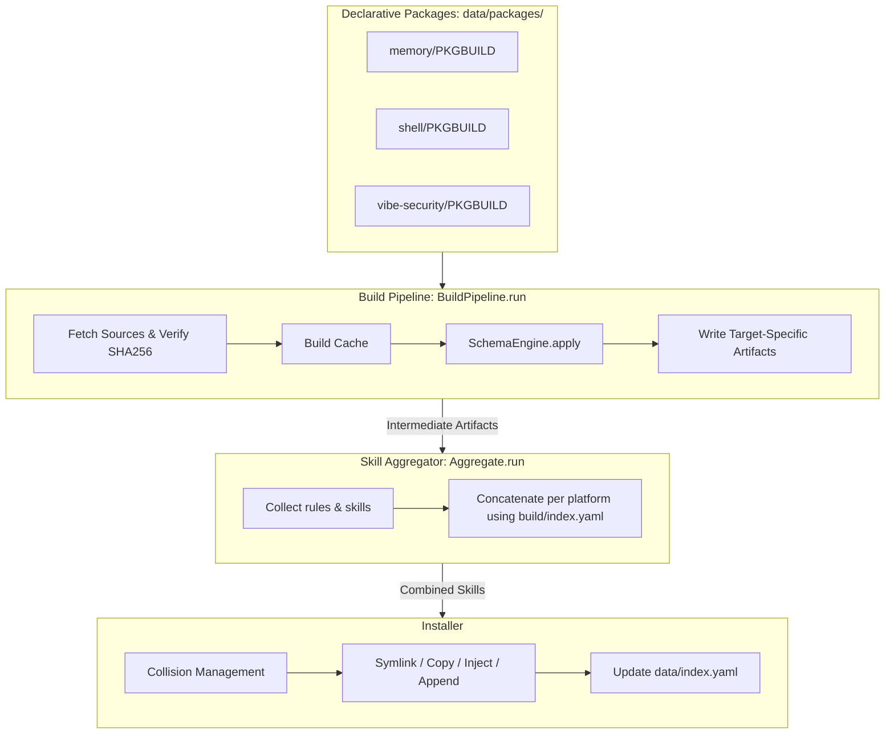

# Rulepack — Developer Guide

> **For users**: See [README.md](README.md) for quick start, commands, platform reference, and environment variables.

---

## Project Overview

Rulepack is a declarative package manager for agent rules, skills, and agent definitions, inspired by Arch Linux's `pacman`/`makepkg`:

- Packages are YAML `PKGBUILD` descriptors under `data/packages/`.
- `bin/rulepack build` fetches sources, validates SHA256 checksums, runs a 4-stage pipeline, and writes artifacts to `build/`.
- `bin/rulepack install` deploys to agent platform directories and records state in `data/index.yaml`.
- `bin/rulepack verify` / `fix` detect and repair drift.

Core purpose: maintain one canonical source of agent instructions and propagate updates safely across local coding agents.

---

## Developer Docs

- **[Architecture](docs/agents/ARCHITECTURE.md)** — pipeline flow, transaction safety, data stores.
- **[Platforms](docs/agents/PLATFORMS.md)** — supported agents, scopes, install paths.
- **[Reference](docs/agents/REFERENCE.md)** — full PKGBUILD grammar and validation rules.
- **[Transforms](docs/agents/TRANSFORMS.md)** — translators, Schema Engine, custom transformers.
- **[Upstream](docs/agents/UPSTREAM.md)** — git/url dependencies and version bumps.
- **[Usage](docs/agents/USAGE.md)** — CLI arguments, return codes, environment variables.

---

## Architecture & Pipeline Flow


```mermaid
graph TD
    subgraph PKG [Declarative Packages: data/packages/]
        M[memory/PKGBUILD]
        S[shell/PKGBUILD]
        V[vibe-security/PKGBUILD]
    end

    subgraph BLD [Build Pipeline: BuildPipeline.run]
        F[Fetch Sources & Verify SHA256] --> C[Build Cache]
        C --> SE[SchemaEngine.apply]
        SE --> W[Write Target-Specific Artifacts]
    end

    subgraph AGG [Skill Aggregator: Aggregate.run]
        SA[Collect rules & skills] --> CA[Concatenate per platform using build/index.yaml]
    end

    subgraph INST [Installer]
        CMS[Collision Management] --> INS[Symlink / Copy / Inject / Append]
        INS --> IDX[Update data/index.yaml]
    end

    PKG --> BLD
    BLD -->|Intermediate Artifacts| AGG
    AGG -->|Combined Skills| INST
```

### Lifecycle Phases

1. **Build** — `Rulepack::Build` loads descriptors, fetches sources, runs the pipeline (`:fetch` → `:translate` → `:schema_engine` → `:transform`), and writes `build/index.yaml`.
2. **Aggregate** — `Rulepack::Aggregate` merges fragments into single skill files for platforms that need them (Crush, Goose, Codex, Droid, etc.).
3. **Install** — `Rulepack::Installer` deploys artifacts via symlink, copy, inject, or append, updating the master index.
4. **Uninstall** — `Rulepack::Uninstaller` removes packages with marker-aware splicing for injected content.
5. **Verify & Fix** — `Rulepack::Verify` checks disk state against the index; `Rulepack::Fix` restores drifted or missing files.

---

## Modular Architecture

The implementation is split across ~66 Ruby files under `lib/rulepack/`. Key modules:

- `common.rb` — explicit composition root: owns `RULEPACK_ROOT`, the scoped Paths/UI contexts (`with_paths` / `with_ui`), and the remaining stateless Logging re-exports. The stateful delegators (IO/Path/Validation/InstallHelpers) were deleted — callers use the owning modules directly. No metaprogrammed flattening.
- `paths.rb` — `Rulepack::Paths` frozen value object (root, build_dir, build_index_path, index_yaml_path); every backend entry point accepts `paths:`, tests build sandbox instances.
- `installed_index.rb` — `Rulepack::InstalledIndex`: the single owner of `data/index.yaml` (existence, load with unconditional schema+record migration, `load_or_fresh`, `save` owning the `:generated` stamp, index backup/restore/cleanup). Never memoized; silent.
- `build_index.rb` — `Rulepack::BuildIndex`: the single owner of `build/index.yaml` (`load` raising typed `BuildIndexNotFound`, `load_or_nil`, the single `write` envelope, `remove`). Never memoized; silent.
- `platforms.rb` — `Rulepack::Platforms.load(root)`: registry loading + validation, memoized per root.
- `installed_state.rb` — `Rulepack::InstalledState.check`: the single "is this installed record intact on disk?" dispatch (pure; returns a typed `Verdict` consumed by Verify, Fix and the check command).
- `ui.rb` — `Rulepack::UI` class (injectable stdin/stdout; `spin`, `confirm`, `collision_prompt`); `UI::Null` for tests. Replaces the old `ENV['RULEPACK_TEST']` branching.
- `encoding_defaults.rb` — sets `Encoding.default_external = UTF-8` early for all entry points and tests.
- `errors.rb` — typed error hierarchy (`Rulepack::Error` + 12 subclasses: `MissingOptionValue`, `InvalidOptionValue`, `InvalidPkgbuild`, `PkgbuildNotFound`, `StateError`, `ConfigError`, `SecurityError`, `UnknownPlatform`, `BuildIndexNotFound`, `IndexNotFound`, `PathTraversalError`).
- `emitter.rb` — lightweight event emitter with subscribe/emit/unsubscribe; supports multiple subscribers per event type.
- `security.rb` — `Rulepack::Security.strip_symlinks_in_tree` as the single source of truth for symlink stripping across build, install, and lazy materialization.
- `lockfile.rb` — `Rulepack::Lockfile` pins `(pkgname, version, source_sha256)` tuples for reproducible installs; supports `enforce!` for `install --locked`.
- `models/package.rb`, `models/platform.rb`, `models/target.rb` — immutable `Data.define` value objects replacing hash-passing; constructed via `.from_hash`, serialized via `#to_h`.
- `catalog/source_repository.rb` — interface (`#fetch`, `#directory`) separating "where a package comes from" from "how it is built".
- `catalog/local_catalog.rb` — wraps existing Source/Cache primitives; default implementation.
- `catalog/remote_catalog.rb` — reads a remote package index over HTTP; supports `search`, `list`, `fetch_package`.
- `reporter/console_renderer.rb` — subscribes to Emitter and reproduces console output.
- `reporter/jsonl_renderer.rb` — emits one JSON object per event (`--format jsonl`).
- `build_loader.rb`, `build_per_pkg.rb`, `build_writer.rb`, `build_pipeline.rb` — build orchestration. The loader returns immutable `Package` models (with `Target` models); `BuildRecord` (`models/build_record.rb`) owns the build-index entry schema and the pipeline threads it value-style.
- `schema_engine.rb` — normalizes frontmatter, emoji, headings, and bullets per platform schema.
- `schema_migration.rb` — migrates legacy `data/index.yaml` schemas.
- `validation.rb` — PKGBUILD structure and field validation (pkgname, versions, sources, targets, transformers, install types, path-traversal guards).
- `install_handlers.rb`, `install_execute.rb`, `transaction.rb` — install logic, marker splicing, backups.
- `skill_bundle.rb` — resolves directory-based skill bundles; install-time lazy materialization for source-centric builds.
- `skill_bundle_lazy.rb` — lazy materialization helpers (`ensure_materialized!`, `materialization_up_to_date?`, `apply_schema_engine_to_directory`); invoked by `skill_bundle.rb#install_skill_bundle` when `build/<plat>/<pkg>/` is missing.
- `cache.rb` — content-addressed source cache with optional size limit.
- `bump.rb` — checks upstream git repos for new commits and optionally auto-updates PKGBUILD versions.
- `outdated.rb` — compares installed versions in `data/index.yaml` against `build/index.yaml` and reports outdated or available-but-not-installed packages.
- `cli_parser.rb` — unified ARGV parser handling pacman-style aliases (`-S`, `-R`, `-Qk`, `-F`, `-Q`) and flags such as `--target`, `--project`, `--on-collision`, `--select`, `--format`, and `--rules-to`.
- `query.rb` — query dispatch for installed packages and manual/orphan items.
- `io.rb` — shared file utilities (`read_text` / `read_binary`).
- `result.rb` — structured `Rulepack::Result` object returned by backend operations.
- `reporter.rb` — renders results as text, JSON, or YAML (yaml/json share the same Result envelope). `--format jsonl` is a stream format: the CLI swaps ConsoleRenderer for JsonlRenderer and emits one JSON object per event plus a final `:result` line — Reporter.print rejects it.
- `cli/commands.rb` — the dispatch table: PACMAN_ALIASES + one row per backend command (backend/method, `phases:` for multi-phase build→aggregate, `transform:` for check→install --check, `max_positional:`). Adding a command is a table row.
- `cli/runner.rb` — the CLI runner: single CliParser parse → alias remap → table/local dispatch → render → exit code. Global exit-code rule: **success → 0, partial/failure → 1** (drift, some-platforms-failed, outdated-found, bump-with-changes all exit 1).
- `platform_scanner.rb` — discovers rulepack-managed and manually installed items on disk.

Library files under `lib/rulepack/` are pure modules — no CLI runner blocks, no `$rulepack_exit_code` global. The CLI (`bin/rulepack`) is the single entry point; dispatch/rendering live in `lib/rulepack/cli/`. Backends return `Result` objects and narrate via `Emitter` events — never raw `puts`. Test sandboxes drive the CLI via `bin/rulepack` subprocesses.

---

## CLI Command Reference

> **Windows:** The `bin/rulepack` script uses a Bash shebang. On Windows, prepend `ruby`: `ruby bin/rulepack <command>`. Alternatively, use `bundle exec ruby bin/rulepack <command>` after `bundle install`.

```bash
# Build
bin/rulepack build
bin/rulepack build -t <plat>                         # Build for specific platform(s)
bin/rulepack build -t cursor,opencode              # Build for multiple target platforms
bin/rulepack build --timing

# Upstream version tracking
bin/rulepack bump [pkg]
bin/rulepack bump --apply [pkg]

# Install / uninstall
bin/rulepack install [pkg] -t <plat|all>
bin/rulepack install [pkg] -t <plat|all> --dry-run --force --select <names>
bin/rulepack install -S [pkg] -t <plat|all>          # pacman-style alias

bin/rulepack uninstall [pkg] -t <plat|all>
bin/rulepack uninstall [pkg] -t <plat|all> --dry-run
bin/rulepack uninstall -R [pkg] -t <plat|all>        # pacman-style alias

### Surgical install / uninstall

```bash
# Install only one package
bin/rulepack install memory -t opencode

# Uninstall only one package
bin/rulepack uninstall memory -t opencode

# Project-level platforms also need --project
bin/rulepack install memory -t cursor --project .
bin/rulepack uninstall memory -t cursor --project .
```

### Collision strategies
bin/rulepack install -t <plat> --on-collision stop|ignore|overwrite|append

# Rules installation mode
bin/rulepack install -t opencode --rules-to rules_dir   # default: symlink/copy individual files
bin/rulepack install -t opencode --rules-to rules_file  # append to AGENTS.md / GEMINI.md without overwriting

# Marker-boundary append preserves existing content:
# Each package is wrapped in <!-- rulepack:<pkg> start --> ... <!-- rulepack:<pkg> end --> blocks.
# Re-install replaces only its own block; uninstall splices it out.

# Drift detection and repair
bin/rulepack verify [pkg] -t <plat|all>
bin/rulepack verify -Qk [pkg] -t <plat|all>          # pacman-style alias
bin/rulepack fix [pkg] -t <plat|all> [--auto]
bin/rulepack fix -F [pkg] -t <plat|all> [--auto]     # pacman-style alias
bin/rulepack outdated -t <plat|all> [--format json|yaml]

# Audit / query
bin/rulepack audit [--strict] [--target PLAT] [--format json]
bin/rulepack query show <pkgname>
bin/rulepack query search <term>
bin/rulepack search <tag>

# Git hook
bin/rulepack init-hooks                              # installs pre-commit audit hook

# Remote registry
bin/rulepack remote search <term>                    # Search remote package index
bin/rulepack remote list                             # List remote packages
bin/rulepack lock                                    # Show lockfile status
```

---

## Backend API

Backend modules return `Rulepack::Result` objects. The CLI renders results via `Rulepack::Reporter`.

```ruby
# Query installed packages and manual/orphan items for a platform
result = Rulepack::Query.installed('opencode')
result.data[:items]
# => [{ name: 'memory', source: :rulepack, status: :ok, type: :rule, path: ... },
#     { name: 'my-skill', source: :manual, status: :orphan, type: :skill, path: ... }]

# Structured verify data
result = Rulepack::Verify.check(target: 'opencode')
result.data[:ok]      # number of packages OK
result.data[:drift]   # number of drifted packages
result.data[:orphans] # number of manual/orphan items
result.data[:platforms].first[:items] # per-package/per-item details

# Render in JSON or YAML
Rulepack::Reporter.print(result, format: :json)
```

All Result-producing commands support `--format text|json|yaml|jsonl` (build, install, uninstall, verify, check, fix, outdated, audit, bump, query/list/show/search/platforms). `jsonl` is a stream format (events + final `:result` line); local helpers (`status`, `catalog`, `remote`, `lock`, `init-hooks`) print plain text. Exit codes are uniform: **0 success, 1 partial/failure** (see `docs/agents/USAGE.md`).

All backend modules return `Rulepack::Result`:

| Module | Data shape |
|---|---|
| `Rulepack::Query.installed` | `{ platform_id, base_path, items: [...] }` |
| `Rulepack::Verify.check` | `{ ok, drift, orphans, platforms: [...] }` |
| `Rulepack::Build.run` | `{ packages_built, packages_failed, build_dir, index_path }` |
| `Rulepack::Install.dispatch` | `{ installed, failed, targets, dry_run }` |
| `Rulepack::Fix.run` | `{ platforms, fixed, failed, orphans_removed, dry_run }` |
| `Rulepack::Uninstaller.dispatch` | `{ uninstalled, targets, dry_run }` |
| `Rulepack::Bump.run` | `{ bump: { packages, summary, applied } }` (report in `messages`) |
| `Rulepack::Audit.run` | `{ audit: { meta, packages } }` (report rendered by `TextRenderer.render_audit`) |
| `Rulepack::Aggregate.run` | `{}` (narration via Emitter events) |

---

## Package Scope & Path Resolution

Scope is defined in `data/registry/platforms.yaml` and can be overridden via `.rulepack.local.yaml` or `~/.config/rulepack/config.yaml`.

| Scope | Behavior | Required flag |
|---|---|---|
| `user` | Installs under the user's home directory (e.g. `~/.config/gemini/`). | None; `--target all` auto-detects installed user-scoped platforms. |
| `project` | Installs inside a project directory (e.g. `.cursor/`). | `--project <path>` (or `-p`). Running without it raises an error. |

> **Note:** `-p` is reserved for `--project`. Use `--dry-run` for install/uninstall previews.

---

## Writing a PKGBUILD Descriptor

Create `data/packages/<pkgname>/PKGBUILD` (YAML).

Packages can also be organized into namespaces:

- `data/packages/<pkgname>/PKGBUILD` — tracked, shared packages (legacy/flat layout).
- `data/packages/upstream/<pkgname>/PKGBUILD` — tracked, online-sourced packages (git/url).
- `data/packages/local/<pkgname>/PKGBUILD` — ignored, personal/local-only packages. **Not included in the repository; each user creates and maintains their own packages here.**

The runtime database (`data/index.yaml`) remains flat; `pkgname` is the global key. Search precedence is `local` → `upstream` → flat, so a local package overrides a tracked package with the same name. `bin/rulepack audit` discovers all namespaces; `bin/rulepack bump` ignores `local/`.

### Package Types

| `pkg_type` | Description | Examples |
|---|---|---|
| `rule` | Agent instructions / constraints. | memory, shell |
| `skill` | Tool-like capability with a `SKILL.md` manifest. | vibe-security |
| `hybrid` | Both rule and skill content; use multiple targets per platform. | — |
| `agent` | Custom agent definition installed to the platform's `agents_dir`. | ruby-update-signatures |

### Important Rules

- `PKGBUILD` must live in the package root, not nested.
- `source.path` is relative to the package root.
- If `source.path` ends with `/`, the source is treated as a directory and `format: skill-bundle` is auto-assigned.
- The `targets:` list is optional. If omitted, the build engine auto-expands to all platforms based on `pkg_type`. Partial entries override only the fields you specify.
- Do not duplicate platform formatting in `transformer` directives. Schema Engine applies `frontmatter`, `emoji_policy`, `heading_style`, and `bullet_style` from `data/platforms/<agent>.yaml` automatically.
- Custom `translate:` / `transformer:` directives are only needed for edge cases.
- Build engine never rewrites the source `PKGBUILD`. URL checksum mismatches are warnings; update `sha256` manually.
- Always run `bin/rulepack audit --strict` after editing a PKGBUILD. Use `bin/rulepack install <pkg> -t <plat> --dry-run` to preview deployment.

### Example: Rule Package

```yaml
---
pkgname: memory-management
pkgver: '1.2.0'
pkgrel: 1
epoch: 0
pkgdesc: Authoritative system rule for memory retention and updates
arch: any
pkg_type: rule
order: 10

source:
  - type: local
    path: src/memory.md

targets:
  - platform: cursor
    output: 00-memory.md
  - platform: codex
    output: memory.md

tags:
  - rules
  - memory
maintainer: Antigravity AI
license: MIT
```

### Example: Agent Package

Agent packages use `format: agent` and install to the platform's `agents_dir`. Files are copied, not symlinked.

| Platform | Scope | Translator | Notes |
|---|---|---|---|
| `opencode` | user | `agent_to_opencode.rb` | Wraps markdown in YAML frontmatter. |
| `oh-my-pi` | user | none | Plain markdown, auto-discovered. |
| `cursor` | project | `agent_to_cursor.rb` | Generates `agent.json` from `agent_config`. |
| `windsurf` | project | none | Plain markdown, auto-discovered. |
| `claude-code` | project | `agent_to_claude_code.rb` | Adds Metadata / System Prompt sections. |

Platforms without `agents_dir` skip `format: agent` targets automatically.

```yaml
pkg_type: agent

targets:
  - platform: opencode
    format: agent
    output: .
    translate: custom:data/translators/agent_to_opencode.rb
    install:
      type: copy
      target_dir: my-agent/

  - platform: cursor
    format: agent
    output: .
    translate: custom:data/translators/agent_to_cursor.rb
    agent_config:
      model: claude-3.5-sonnet
      temperature: 0.3
      triggers:
        file_patterns: ["*.rb", "*.rbs"]
    install:
      type: copy
      target_dir: my-agent/

  - platform: claude-code
    format: agent
    output: .
    translate: custom:data/translators/agent_to_claude_code.rb
    install:
      type: copy
      target_dir: my-agent/
```

### Package Directory Structure

Shared/tracked packages live in the flat layout or `upstream/` namespace. Personal packages go under `local/` (git-ignored). A fresh clone ships with an empty `local/` directory.

```
data/packages/
├── <pkgname>/                    # Tracked shared package (legacy/flat)
│   ├── PKGBUILD                  # Required
│   ├── src/                      # Optional source markdown
│   ├── data/                     # Optional fixtures / metadata
│   └── translators/              # Optional custom translators
├── upstream/<pkgname>/           # Tracked online-sourced package
│   └── PKGBUILD
└── local/<pkgname>/              # Personal/local-only package (ignored, user-created)
    └── PKGBUILD
```

---

## Testing & Code Conventions

- **Ruby version**: see `.ruby-version`. Use `bundle install` to install the test toolchain (`minitest`, `rake`).
- **Subprocess elimination**: avoid spawning shells where possible; a small number of legacy subprocess calls (`git`, `tar`, `pkgver_func`) remain and are being phased out.
- **Immutable strings**: every file must declare `# frozen_string_literal: true`.
- **Pathname API**: use `Pathname` instead of string concatenation for paths.
- **Tests**: run `bundle exec rake test`. Run `bundle exec rake summary` for a dynamic test count (scans test files for `def test_` and `assert` calls). Network-dependent E2E tests are gated behind `NETWORK_E2E`. The `test_source_centric_build.rb` file covers the four source-centric acceptance criteria (build does not materialize, install materializes lazily, store dedup, e2e contract).

---

## Notable Features

- **UTF-8 by default**: `encoding_defaults.rb` forces UTF-8 encoding, preventing ASCII encoding errors in markdown.
- **Git HTTP fallback**: when `git` is unavailable, the build engine falls back to GitHub/GitLab tarballs using Ruby's built-in `Zlib` and `Gem::Package::TarReader` — no shell subprocesses. Tar extraction is hardened against path traversal (Tar Slip) via `File.expand_path` prefix validation with a `PathTraversalError` guard.
- **Source-centric build (2026-07-29)**: Skill-bundles are **lazily materialized at install time**, not eagerly written to `build/<plat>/<pkg>/`. Build records metadata (`available_targets`, `source_sha`); install copies from `pkgdata[:source_dir]` into `build/<plat>/<pkg>/` on demand, gated by `manifest.json` `source_sha256`. Shrunken `build/` from 1.3 GB → 46 MB (−96.5%) for the `anthropics-skills` workload. See [`ADR-2026-07-29-build-pipeline-refactor.md`](docs/improvement-plan/ADR-2026-07-29-build-pipeline-refactor.md) and `lib/rulepack/lib/skill_bundle_lazy.rb`.

  **Baseline comparison (pre vs post):**

  | Metric | Before | After | Change |
  |---|---|---|---|
  | `build/` total size | 1.3 GB | 46 MB | −96.5% |
  | `build/` (excl. git-sources) | 1.26 GB | 2.1 MB | −99.8% |
  | Store files | N/A | 52 | — |
  | Store size | N/A | 272 KB | — |
  | `(pkg, target)` slots | 266 | 266 | (unchanged) |
  | Store dedup ratio | 0% | **80.83%** (51 store / 266 slots) | — |
  | Cross-package dedup | N/A | 0% (each store file → 1 package) | — |
  | Test suite | 390 runs, 1191 assertions | 394 runs, 1216 assertions | +4/+25 |
  | Test failures/errors | 0/4 | 0/0 | −4 errors |
  | `bin/rulepack audit --strict` | — | 18/18 ✓ VALID | — |
- **Local registry overrides**: `.rulepack.local.yaml` (per-repo) and `~/.config/rulepack/config.yaml` (user-global) are deep-merged on top of `data/registry/platforms.yaml`.
- **Git hook integration**: `bin/rulepack init-hooks` installs a pre-commit hook that runs `bin/rulepack audit --strict`.
- **Sub-skill selector**: `bin/rulepack install <skill-bundle> -t <plat> --select` opens an interactive multi-select menu. Press `q` / `Esc` / `Ctrl-C` to cancel; `Enter` confirms selection.
- **Uninstall dry-run diff**: `bin/rulepack uninstall <pkg> -t <plat> --dry-run` shows the exact marker-bounded lines that would be removed from injected targets.
- **Outdated check**: `bin/rulepack outdated -t <plat>` compares installed package versions with `build/index.yaml` and lists outdated and available-but-not-installed packages.
- **Agent drift handling**: agent packages are verified by directory existence, not checksums, avoiding false positives on platforms without `agents_dir`.
- **Skill-bundle manifest checksums**: `manifest.json` is generated after Schema Engine runs so stored checksums match installed files and `verify` stays accurate. The `source_sha256` field in `manifest.json` also gates lazy re-materialization on source change.
- **Schema Profile Union**: `BuildPerPkg` computes SHA256 transform signatures (`union_key`) and caches pipeline outputs in memory. Targets sharing identical translators, schema rulesets, and transformers reuse transformed content without re-running passes.
- **Target-scoped builds**: `bin/rulepack build -t <plat>` filters target platforms, building artifacts exclusively for active platform(s).
- **Transactional fix**: `bin/rulepack fix` detects broken packages via `InstalledState` and reinstalls them in **one transactional `Install.run` call** with `force_packages:` — Install backs up the index and journals file operations, so a failure rolls both back.
- **Event substrate (2026-08-01)**: `Rulepack::Emitter` provides a lightweight subscribe/emit/unsubscribe pattern. **All backends narrate via events** — no raw `puts` in `lib/`. Renderers: `ConsoleRenderer` (default, byte-identical text) and `JsonlRenderer` (`--format jsonl`: one JSON object per event plus a final `:result` line). See `lib/rulepack/emitter.rb` and `lib/rulepack/reporter/`.
- **Immutable domain models (2026-08-01)**: `Rulepack::Package`, `Rulepack::Platform`, `Rulepack::Target`, `Rulepack::BuildRecord`, and `Rulepack::InstalledRecord` are frozen `Data.define` value objects. `BuildRecord` owns the build-index entry schema; `InstalledRecord` (`models/installed_record.rb`) owns the installed-record schema of `data/index.yaml` at the `from_h`/`to_h` boundary — disk format unchanged. Don't write installed-record keys anywhere else. See `lib/rulepack/models/`.
- **Catalog abstraction (2026-08-01)**: `Rulepack::Catalog::SourceRepository` interface with `LocalCatalog` (wrapping existing primitives; takes `paths:` via constructor) and `RemoteCatalog` (HTTP-based remote index with `search`, `list`, `fetch_package`). See `lib/rulepack/catalog/`.
- **Lockfile (2026-08-01)**: `Rulepack::Lockfile` pins `(pkgname, version, source_sha256)` tuples for reproducible installs. Supports `enforce!` for `install --locked`. See `lib/rulepack/lockfile.rb`.
- **Explicit composition root (2026-09-15, collapsed 2026-09-16)**: `common.rb` has no metaprogrammed flattening. The stateful re-export groups (IO/Path/Validation/InstallHelpers) are **deleted** — call the owning modules directly (`Rulepack::IO.load_yaml`, `Rulepack::Path.expand_user_path`, …); `test/test_common_facade.rb` guards they stay off Common. Logging re-exports remain (stateless, spelling only). Scoped `Paths`/`UI` contexts (`Common.with_paths` / `Common.with_ui`) replace global override setters and env-var branching.
- **Backend seams (2026-09-16)**: every backend entry point (Build, Aggregate, Install, Uninstall, Verify, Query, Audit, Fix, Outdated, Bump) accepts `paths:`/`ui:` and opens its scope internally — dependencies are visible in signatures. Note: internal backend calls pass the options hash **positionally** (`run(plat, { dry_run: … })`) — Ruby 4 no longer converts a positional hash to keyword arguments, so keyword-style calls collide with the `paths:`/`ui:` keywords.
- **CLI spine (2026-09-16)**: `lib/rulepack/cli/commands.rb` is the real dispatch table (aliases, phases, transforms); `lib/rulepack/cli/runner.rb` parses once, renders once, and applies one exit-code rule (success 0, partial/failure 1). All Result-producing commands support `--format text|json|yaml|jsonl`.
- **Index store ownership (2026-09-19)**: `InstalledIndex` and `BuildIndex` are the only readers/writers of `data/index.yaml` and `build/index.yaml`; every access resolves through the scoped `Paths` — the repo-anchored `Common::BUILD_DIR`/`BUILD_INDEX_PATH`/`INDEX_YAML_PATH`/`LOG_PATH` constants are deleted, so there is no scope-blind path left to bypass a sandbox with. `InstalledIndex.load` always migrates (SchemaMigration + `InstalledRecord.migrate_legacy!`); callers never migrate by hand. Neither store memoizes — callers mutate the loaded hash in place. `Fix.run`→`Install.run` passes the options hash positionally (the Ruby 4 keyword-collision crash is fixed and pinned by in-process sandbox tests in `test/test_fix.rb`).

For detailed improvement notes, see [`docs/improvement-plan/OPEN-ITEMS.md`](docs/improvement-plan/OPEN-ITEMS.md). For the source-centric refactor decision and rationale (including the deferred cross-package union cache), see [`ADR-2026-07-29-build-pipeline-refactor.md`](docs/improvement-plan/ADR-2026-07-29-build-pipeline-refactor.md).

---

## Known Issues


---

## Notes & Gotchas

- **`source_sha256` is never nil for materializable packages**: `fetch_skill_bundle_source` computes a deterministic content hash of the source tree (`Rulepack::SkillBundle.compute_local_source_sha`) for local sources, or records the git commit hash — so the install-time materialization staleness gate always compares real fingerprints. `skill_bundle.rb` hard-errors on a missing `source_sha256` (stale pre-BuildRecord build index) instead of falling back.
- **`BuildPerPkg.fetch_skill_bundle_source` aborts on `pkgver_func` failure**: `run_pkgver_func` returns `[ok, pkg, record]`; failure returns the record without downstream target processing. Success refreshes `pkgver` on both the Package (via `Data#with`) and the record. Failure must abort the package without partial state.
- **The build-index entry schema is owned by `Rulepack::BuildRecord`** (`models/build_record.rb`): `from_package` seeds it, the pipeline accumulates runtime fields via `Data#with`, `to_h` serializes and enforces invariants (materializable packages must carry `source_sha256`; legacy `:status`/`:installed` keys are gone; `:pkg_type` is always present). Don't write build-index keys anywhere else.
- **Platform registry is memoized per root**: `Rulepack::Platforms.load(root)` caches in a hash keyed by the expanded root path. `Common.load_platform_registry` resolves the **scoped** root: a sandbox that relocates paths via `with_paths` gets its own registry if it ships `data/registry/platforms.yaml`, and inherits the repo registry otherwise (relocation, not isolation). Tests that mutate the *repo* registry must still call `Rulepack::Platforms.clear_cache!`. Scope via `Rulepack::Common.with_paths(...)` or pass `paths:` to any backend entry point.
- **Cross-package union cache deferred (YAGNI)**: empirical inspection shows distinct `source_sha256` per package, so a content-addressed union cache across packages has no hits in the current dataset. The per-package `union_key` cache in `build_per_pkg.rb` already collapses the 14 platforms per package into 1 store file (52 files, ~272 KB). Re-open only if future packages share source content (e.g. monorepo forks).
- **Build dir is now near-empty for skill-bundles**: post-refactor, `build/<plat>/<pkg>/` is created **only at install time** for skill-bundles. If you see a skill-bundle with no `build/<plat>/<pkg>/` directory, that is expected — running `bin/rulepack install <pkg> -t <plat>` will populate it. `bin/rulepack verify` also triggers materialization.
- **Standalone script entry points were removed (2026-09-15)**: `lib/rulepack/*.rb` files cannot be run as CLI scripts anymore (`ruby lib/rulepack/build.rb` fails). Use `bin/rulepack` (or `ruby bin/rulepack` on Windows). Pacman aliases (`-S`, `-R`, `-Qk`, `-F`, `-Q`) are handled solely by the CLI dispatch table (`lib/rulepack/cli/commands.rb`); `CliParser` and backends never see them. E2E/integration tests copy `bin/` plus `lib/` and `data/` into sandboxes and drive `bin/rulepack` subprocesses.
- **`encoding_defaults.rb` must be loaded before any other `lib/rulepack/` file**: it sets `Encoding.default_external = Encoding::UTF_8` early. If it is accidentally dropped from an entry point (e.g. `bin/rulepack`), markdown files with non-ASCII characters will raise `Encoding::UndefinedConversionError`. Always verify it is required before `require "lib/rulepack"`.
- **`Rulepack::Security.strip_symlinks_in_tree` is the single source of truth**: three files (`build_per_pkg.rb`, `skill_bundle_lazy.rb`, `install_execute.rb`) previously had inline symlink-stripping logic. All now delegate to `lib/rulepack/security.rb`. Any new code that needs to strip symlinks from a directory tree must call this method, not reimplement it.
- **`lib/rulepack.rb` is the library entry point**: `require "lib/rulepack"` loads the typed error hierarchy, encoding defaults, and all submodules. `bin/rulepack` and tests should use this entry point rather than requiring individual files. The `require_relative 'errors'` in `common.rb` ensures errors are available even when `common.rb` is loaded directly.
- **Minimal inline technical debt (updated 2026-09-16)**: the installed-record schema is owned by `InstalledRecord`, disk-state verdicts by `InstalledState.check`, and the former `BuildPipeline` stage machine is inlined as `BuildPerPkg.run_content_passes` (translate → schema engine → transform). Remaining known items: `LocalCatalog` has no injection seam (scoped `Common.paths` only); most improvement work is tracked externally in `docs/improvement-plan/OPEN-ITEMS.md`.
