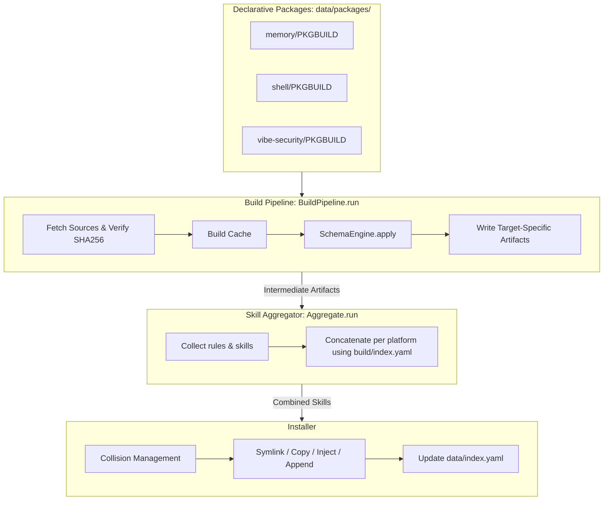

# Rulepack — Developer Guide

> **For users**: See [README.md](README.md) for quick start, commands, platform reference, and environment variables.

---

## Project Overview

Rulepack is a declarative package manager for agent rules, skills, and agent definitions, inspired by Arch Linux's `pacman`/`makepkg`:

- Packages are YAML `PKGBUILD` descriptors under `data/packages/`.
- `bin/rulepack build` fetches sources, validates SHA256 checksums, runs a 4-stage pipeline, and writes artifacts to `build/`.
- `bin/rulepack install` deploys to agent platform directories and records state in `data/index.yaml`.
- `bin/rulepack verify` / `fix` detect and repair drift.

Core purpose: maintain one canonical source of agent instructions and propagate updates safely across local coding agents.

---

## Developer Docs

- **[Architecture](docs/agents/ARCHITECTURE.md)** — pipeline flow, transaction safety, data stores.
- **[Platforms](docs/agents/PLATFORMS.md)** — supported agents, scopes, install paths.
- **[Reference](docs/agents/REFERENCE.md)** — full PKGBUILD grammar and validation rules.
- **[Transforms](docs/agents/TRANSFORMS.md)** — translators, Schema Engine, custom transformers.
- **[Upstream](docs/agents/UPSTREAM.md)** — git/url dependencies and version bumps.
- **[Usage](docs/agents/USAGE.md)** — CLI arguments, return codes, environment variables.

---

## Architecture & Pipeline Flow


```mermaid
graph TD
    subgraph PKG [Declarative Packages: data/packages/]
        M[memory/PKGBUILD]
        S[shell/PKGBUILD]
        V[vibe-security/PKGBUILD]
    end

    subgraph BLD [Build Pipeline: BuildPipeline.run]
        F[Fetch Sources & Verify SHA256] --> C[Build Cache]
        C --> SE[SchemaEngine.apply]
        SE --> W[Write Target-Specific Artifacts]
    end

    subgraph AGG [Skill Aggregator: Aggregate.run]
        SA[Collect rules & skills] --> CA[Concatenate per platform using build/index.yaml]
    end

    subgraph INST [Installer]
        CMS[Collision Management] --> INS[Symlink / Copy / Inject / Append]
        INS --> IDX[Update data/index.yaml]
    end

    PKG --> BLD
    BLD -->|Intermediate Artifacts| AGG
    AGG -->|Combined Skills| INST
```

### Lifecycle Phases

1. **Build** — `Rulepack::Build` loads descriptors, fetches sources, runs the pipeline (`:fetch` → `:translate` → `:schema_engine` → `:transform`), and writes `build/index.yaml`.
2. **Aggregate** — `Rulepack::Aggregate` merges fragments into single skill files for platforms that need them (Crush, Goose, Codex, Droid, etc.).
3. **Install** — `Rulepack::Installer` deploys artifacts via symlink, copy, inject, or append, updating the master index.
4. **Uninstall** — `Rulepack::Uninstaller` removes packages with marker-aware splicing for injected content.
5. **Verify & Fix** — `Rulepack::Verify` checks disk state against the index; `Rulepack::Fix` restores drifted or missing files.

---

## Modular Architecture

The implementation is split across ~42 Ruby files under `lib/rulepack/`. Key modules:

- `common.rb` — facade re-exporting submodule APIs for backward compatibility.
- `encoding_defaults.rb` — sets `Encoding.default_external = UTF-8` early for all entry points and tests.
- `build_loader.rb`, `build_per_pkg.rb`, `build_writer.rb`, `build_pipeline.rb` — build orchestration.
- `schema_engine.rb` — normalizes frontmatter, emoji, headings, and bullets per platform schema.
- `schema_migration.rb` — migrates legacy `data/index.yaml` schemas.
- `validation.rb` — PKGBUILD structure and field validation (pkgname, versions, sources, targets, transformers, install types, path-traversal guards).
- `install_handlers.rb`, `install_execute.rb`, `transaction.rb` — install logic, marker splicing, backups.
- `skill_bundle.rb` — resolves directory-based skill bundles; install-time lazy materialization for source-centric builds.
- `skill_bundle_lazy.rb` — lazy materialization helpers (`ensure_materialized!`, `materialization_up_to_date?`, `apply_schema_engine_to_directory`); invoked by `skill_bundle.rb#install_skill_bundle` when `build/<plat>/<pkg>/` is missing.
- `cache.rb` — content-addressed source cache with optional size limit.
- `bump.rb` — checks upstream git repos for new commits and optionally auto-updates PKGBUILD versions.
- `outdated.rb` — compares installed versions in `data/index.yaml` against `build/index.yaml` and reports outdated or available-but-not-installed packages.
- `cli_parser.rb` — unified ARGV parser handling pacman-style aliases (`-S`, `-R`, `-Qk`, `-F`, `-Q`) and flags such as `--target`, `--project`, `--on-collision`, `--select`, `--format`, and `--rules-to`.
- `query.rb` — query dispatch for installed packages and manual/orphan items.
- `io.rb` — shared file utilities (`read_text` / `read_binary`).
- `result.rb` — structured `Rulepack::Result` object returned by backend operations.
- `reporter.rb` — renders results as text, JSON, or YAML.
- `platform_scanner.rb` — discovers rulepack-managed and manually installed items on disk.

Procedural entry points (`build.rb`, `verify.rb`, `fix.rb`, `aggregate.rb`, etc.) are namespaced with caller-aware runner hooks, usable programmatically or as CLI scripts. Note that several still call `exit N` on failure paths, which can terminate the host process when used as a library; wrap them or run in a subprocess for programmatic reuse.

---

## CLI Command Reference

> **Windows:** The `bin/rulepack` script uses a Bash shebang. On Windows, prepend `ruby`: `ruby bin/rulepack <command>`. Alternatively, use `bundle exec ruby bin/rulepack <command>` after `bundle install`.

```bash
# Build
bin/rulepack build
bin/rulepack build -t <plat>                         # Build for specific platform(s)
bin/rulepack build -t cursor,opencode              # Build for multiple target platforms
bin/rulepack build --timing

# Upstream version tracking
bin/rulepack bump [pkg]
bin/rulepack bump --apply [pkg]

# Install / uninstall
bin/rulepack install [pkg] -t <plat|all>
bin/rulepack install [pkg] -t <plat|all> --dry-run --force --select <names>
bin/rulepack install -S [pkg] -t <plat|all>          # pacman-style alias

bin/rulepack uninstall [pkg] -t <plat|all>
bin/rulepack uninstall [pkg] -t <plat|all> --dry-run
bin/rulepack uninstall -R [pkg] -t <plat|all>        # pacman-style alias

### Surgical install / uninstall

```bash
# Install only one package
bin/rulepack install memory -t opencode

# Uninstall only one package
bin/rulepack uninstall memory -t opencode

# Project-level platforms also need --project
bin/rulepack install memory -t cursor --project .
bin/rulepack uninstall memory -t cursor --project .
```

### Collision strategies
bin/rulepack install -t <plat> --on-collision stop|ignore|overwrite|append

# Rules installation mode
bin/rulepack install -t opencode --rules-to rules_dir   # default: symlink/copy individual files
bin/rulepack install -t opencode --rules-to rules_file  # append to AGENTS.md / GEMINI.md without overwriting

# Marker-boundary append preserves existing content:
# Each package is wrapped in <!-- rulepack:<pkg> start --> ... <!-- rulepack:<pkg> end --> blocks.
# Re-install replaces only its own block; uninstall splices it out.

# Drift detection and repair
bin/rulepack verify [pkg] -t <plat|all>
bin/rulepack verify -Qk [pkg] -t <plat|all>          # pacman-style alias
bin/rulepack fix [pkg] -t <plat|all> [--auto]
bin/rulepack fix -F [pkg] -t <plat|all> [--auto]     # pacman-style alias
bin/rulepack outdated -t <plat|all> [--format json|yaml]

# Audit / query
bin/rulepack audit [--strict] [--target PLAT] [--format json]
bin/rulepack query show <pkgname>
bin/rulepack query search <term>
bin/rulepack search <tag>

# Git hook
bin/rulepack init-hooks                              # installs pre-commit audit hook
```

---

## Backend API

Backend modules return `Rulepack::Result` objects. The CLI renders results via `Rulepack::Reporter`.

```ruby
# Query installed packages and manual/orphan items for a platform
result = Rulepack::Query.installed('opencode')
result.data[:items]
# => [{ name: 'memory', source: :rulepack, status: :ok, type: :rule, path: ... },
#     { name: 'my-skill', source: :manual, status: :orphan, type: :skill, path: ... }]

# Structured verify data
result = Rulepack::Verify.check(target: 'opencode')
result.data[:ok]      # number of packages OK
result.data[:drift]   # number of drifted packages
result.data[:orphans] # number of manual/orphan items
result.data[:platforms].first[:items] # per-package/per-item details

# Render in JSON or YAML
Rulepack::Reporter.print(result, format: :json)
```

CLI commands that support `--format json` / `--format yaml`:

- `bin/rulepack query ... --format json`
- `bin/rulepack verify ... --format json`
- `bin/rulepack build ... --format json`
- `bin/rulepack install ... --format json`
- `bin/rulepack fix ... --format json`
- `bin/rulepack uninstall ... --format json`

All backend modules return `Rulepack::Result`:

| Module | Data shape |
|---|---|
| `Rulepack::Query.installed` | `{ platform_id, base_path, items: [...] }` |
| `Rulepack::Verify.check` | `{ ok, drift, orphans, platforms: [...] }` |
| `Rulepack::Build.run` | `{ packages_built, packages_failed, build_dir, index_path }` |
| `Rulepack::Install.dispatch` | `{ installed, failed, targets, dry_run }` |
| `Rulepack::Fix.run` | `{ platforms, fixed, failed, orphans_removed, dry_run }` |
| `Rulepack::Uninstaller.dispatch` | `{ uninstalled, targets, dry_run }` |

---

## Package Scope & Path Resolution

Scope is defined in `data/registry/platforms.yaml` and can be overridden via `.rulepack.local.yaml` or `~/.config/rulepack/config.yaml`.

| Scope | Behavior | Required flag |
|---|---|---|
| `user` | Installs under the user's home directory (e.g. `~/.config/gemini/`). | None; `--target all` auto-detects installed user-scoped platforms. |
| `project` | Installs inside a project directory (e.g. `.cursor/`). | `--project <path>` (or `-p`). Running without it raises an error. |

> **Note:** `-p` is reserved for `--project`. Use `--dry-run` for install/uninstall previews.

---

## Writing a PKGBUILD Descriptor

Create `data/packages/<pkgname>/PKGBUILD` (YAML).

Packages can also be organized into namespaces:

- `data/packages/<pkgname>/PKGBUILD` — tracked, shared packages (legacy/flat layout).
- `data/packages/upstream/<pkgname>/PKGBUILD` — tracked, online-sourced packages (git/url).
- `data/packages/local/<pkgname>/PKGBUILD` — ignored, personal/local-only packages. **Not included in the repository; each user creates and maintains their own packages here.**

The runtime database (`data/index.yaml`) remains flat; `pkgname` is the global key. Search precedence is `local` → `upstream` → flat, so a local package overrides a tracked package with the same name. `bin/rulepack audit` discovers all namespaces; `bin/rulepack bump` ignores `local/`.

### Package Types

| `pkg_type` | Description | Examples |
|---|---|---|
| `rule` | Agent instructions / constraints. | memory, shell |
| `skill` | Tool-like capability with a `SKILL.md` manifest. | vibe-security |
| `hybrid` | Both rule and skill content; use multiple targets per platform. | — |
| `agent` | Custom agent definition installed to the platform's `agents_dir`. | ruby-update-signatures |

### Important Rules

- `PKGBUILD` must live in the package root, not nested.
- `source.path` is relative to the package root.
- If `source.path` ends with `/`, the source is treated as a directory and `format: skill-bundle` is auto-assigned.
- The `targets:` list is optional. If omitted, the build engine auto-expands to all platforms based on `pkg_type`. Partial entries override only the fields you specify.
- Do not duplicate platform formatting in `transformer` directives. Schema Engine applies `frontmatter`, `emoji_policy`, `heading_style`, and `bullet_style` from `data/platforms/<agent>.yaml` automatically.
- Custom `translate:` / `transformer:` directives are only needed for edge cases.
- Build engine never rewrites the source `PKGBUILD`. URL checksum mismatches are warnings; update `sha256` manually.
- Always run `bin/rulepack audit --strict` after editing a PKGBUILD. Use `bin/rulepack install <pkg> -t <plat> --dry-run` to preview deployment.

### Example: Rule Package

```yaml
---
pkgname: memory-management
pkgver: '1.2.0'
pkgrel: 1
epoch: 0
pkgdesc: Authoritative system rule for memory retention and updates
arch: any
pkg_type: rule
order: 10

source:
  - type: local
    path: src/memory.md

targets:
  - platform: cursor
    output: 00-memory.md
  - platform: codex
    output: memory.md

tags:
  - rules
  - memory
maintainer: Antigravity AI
license: MIT
```

### Example: Agent Package

Agent packages use `format: agent` and install to the platform's `agents_dir`. Files are copied, not symlinked.

| Platform | Scope | Translator | Notes |
|---|---|---|---|
| `opencode` | user | `agent_to_opencode.rb` | Wraps markdown in YAML frontmatter. |
| `oh-my-pi` | user | none | Plain markdown, auto-discovered. |
| `cursor` | project | `agent_to_cursor.rb` | Generates `agent.json` from `agent_config`. |
| `windsurf` | project | none | Plain markdown, auto-discovered. |
| `claude-code` | project | `agent_to_claude_code.rb` | Adds Metadata / System Prompt sections. |

Platforms without `agents_dir` skip `format: agent` targets automatically.

```yaml
pkg_type: agent

targets:
  - platform: opencode
    format: agent
    output: .
    translate: custom:data/translators/agent_to_opencode.rb
    install:
      type: copy
      target_dir: my-agent/

  - platform: cursor
    format: agent
    output: .
    translate: custom:data/translators/agent_to_cursor.rb
    agent_config:
      model: claude-3.5-sonnet
      temperature: 0.3
      triggers:
        file_patterns: ["*.rb", "*.rbs"]
    install:
      type: copy
      target_dir: my-agent/

  - platform: claude-code
    format: agent
    output: .
    translate: custom:data/translators/agent_to_claude_code.rb
    install:
      type: copy
      target_dir: my-agent/
```

### Package Directory Structure

Shared/tracked packages live in the flat layout or `upstream/` namespace. Personal packages go under `local/` (git-ignored). A fresh clone ships with an empty `local/` directory.

```
data/packages/
├── <pkgname>/                    # Tracked shared package (legacy/flat)
│   ├── PKGBUILD                  # Required
│   ├── src/                      # Optional source markdown
│   ├── data/                     # Optional fixtures / metadata
│   └── translators/              # Optional custom translators
├── upstream/<pkgname>/           # Tracked online-sourced package
│   └── PKGBUILD
└── local/<pkgname>/              # Personal/local-only package (ignored, user-created)
    └── PKGBUILD
```

---

## Testing & Code Conventions

- **Ruby version**: see `.ruby-version`. Use `bundle install` to install the test toolchain (`minitest`, `rake`).
- **Subprocess elimination**: avoid spawning shells where possible; a small number of legacy subprocess calls (`git`, `tar`, `pkgver_func`) remain and are being phased out.
- **Immutable strings**: every file must declare `# frozen_string_literal: true`.
- **Pathname API**: use `Pathname` instead of string concatenation for paths.
- **Tests**: run `bundle exec rake test`. The suite has 394 tests and 1216 assertions; network-dependent E2E tests are gated behind `NETWORK_E2E`. The `test_source_centric_build.rb` file covers the four source-centric acceptance criteria (build does not materialize, install materializes lazily, store dedup, e2e contract).

---

## Notable Features

- **UTF-8 by default**: `encoding_defaults.rb` forces UTF-8 encoding, preventing ASCII encoding errors in markdown.
- **Git HTTP fallback**: when `git` is unavailable, the build engine falls back to GitHub/GitLab tarballs using Ruby's built-in `Zlib` and `Gem::Package::TarReader` — no shell subprocesses. Tar extraction is hardened against path traversal (Tar Slip) via `File.expand_path` prefix validation with a `PathTraversalError` guard.
- **Source-centric build (2026-07-29)**: Skill-bundles are **lazily materialized at install time**, not eagerly written to `build/<plat>/<pkg>/`. Build records metadata (`available_targets`, `source_sha`); install copies from `pkgdata[:source_dir]` into `build/<plat>/<pkg>/` on demand, gated by `manifest.json` `source_sha256`. Shrunken `build/` from 1.3 GB → 46 MB (−96.5%) for the `anthropics-skills` workload. See [`ADR-2026-07-29-build-pipeline-refactor.md`](docs/improvement-plan/ADR-2026-07-29-build-pipeline-refactor.md) and `lib/rulepack/lib/skill_bundle_lazy.rb`.

  **Baseline comparison (pre vs post):**

  | Metric | Before | After | Change |
  |---|---|---|---|
  | `build/` total size | 1.3 GB | 46 MB | −96.5% |
  | `build/` (excl. git-sources) | 1.26 GB | 2.1 MB | −99.8% |
  | Store files | N/A | 52 | — |
  | Store size | N/A | 272 KB | — |
  | `(pkg, target)` slots | 266 | 266 | (unchanged) |
  | Store dedup ratio | 0% | **80.83%** (51 store / 266 slots) | — |
  | Cross-package dedup | N/A | 0% (each store file → 1 package) | — |
  | Test suite | 390 runs, 1191 assertions | 394 runs, 1216 assertions | +4/+25 |
  | Test failures/errors | 0/4 | 0/0 | −4 errors |
  | `bin/rulepack audit --strict` | — | 18/18 ✓ VALID | — |
- **Local registry overrides**: `.rulepack.local.yaml` (per-repo) and `~/.config/rulepack/config.yaml` (user-global) are deep-merged on top of `data/registry/platforms.yaml`.
- **Git hook integration**: `bin/rulepack init-hooks` installs a pre-commit hook that runs `bin/rulepack audit --strict`.
- **Sub-skill selector**: `bin/rulepack install <skill-bundle> -t <plat> --select` opens an interactive multi-select menu. Press `q` / `Esc` / `Ctrl-C` to cancel; `Enter` confirms selection.
- **Uninstall dry-run diff**: `bin/rulepack uninstall <pkg> -t <plat> --dry-run` shows the exact marker-bounded lines that would be removed from injected targets.
- **Outdated check**: `bin/rulepack outdated -t <plat>` compares installed package versions with `build/index.yaml` and lists outdated and available-but-not-installed packages.
- **Agent drift handling**: agent packages are verified by directory existence, not checksums, avoiding false positives on platforms without `agents_dir`.
- **Skill-bundle manifest checksums**: `manifest.json` is generated after Schema Engine runs so stored checksums match installed files and `verify` stays accurate. The `source_sha256` field in `manifest.json` also gates lazy re-materialization on source change.
- **Schema Profile Union**: `BuildPerPkg` computes SHA256 transform signatures (`union_key`) and caches pipeline outputs in memory. Targets sharing identical translators, schema rulesets, and transformers reuse transformed content without re-running passes.
- **Target-scoped builds**: `bin/rulepack build -t <plat>` filters target platforms, building artifacts exclusively for active platform(s).
- **Transactional fix**: `bin/rulepack fix` backs up the original index and commits the cleared state only after all reinstalls succeed; on failure it rolls back.

For detailed improvement notes, see [`docs/improvement-plan/OPEN-ITEMS.md`](docs/improvement-plan/OPEN-ITEMS.md). For the source-centric refactor decision and rationale (including the deferred cross-package union cache), see [`ADR-2026-07-29-build-pipeline-refactor.md`](docs/improvement-plan/ADR-2026-07-29-build-pipeline-refactor.md).

---

## Known Issues

- **Library modules terminate via `exit N`**: seventeen hard `exit 0` / `exit 1` calls are scattered across `lib/rulepack/{build,verify,fix,install,uninstall,aggregate,audit,outdated,translate,install_execute}.rb`. These files are documented as usable both as CLI scripts and programmatically (caller-aware runner hooks), so calling `exit` inside business logic couples library code to process termination and complicates unit testing and reuse. Prefer returning `Rulepack::Result` failures and letting `bin/rulepack` decide the exit code.
- **`CliParser` raises bare `String` errors**: missing or invalid options raise plain strings (`raise 'Missing value for --target'` / `raise "Invalid collision strategy: ..."`). This forces callers to rescue `RuntimeError` and parse message text instead of dispatching on typed exception classes. Introduce a small `Rulepack::CliError` hierarchy if you extend option validation.

---

## Notes & Gotchas

- **Local-source skill-bundles have `nil` `source_sha256`**: `data/packages/local/<pkg>/PKGBUILD` without a `pkgver_func` (e.g. `line-repetition-control`) sets `pkg_index[:source_sha256] = nil`. `install_skill_bundle` falls back to `compute_local_source_sha(pkgdata[:source_dir])` (SHA256 over the local source tree) so lazy materialization still has a truthy `source_sha` to gate re-materialization. Don't add a guard that rejects `nil` here without a fallback.
- **`BuildPerPkg.fetch_skill_bundle_source` early-returns on `pkgver_func` failure**: the line `run_pkgver_func(pkg, pkgname, pkg_index, source_dir) || return` returns from the caller after `source_dir` is set but before downstream consumers see it. If you refactor this method, preserve the contract: success updates `pkg_index[:source_sha256]`; failure aborts the package without partial state.
- **Platform registry is memoized**: `Rulepack::Common.load_platform_registry` caches via `@_platform_registry`. Tests that mutate `data/registry/platforms.yaml` or layer overrides must call `Rulepack::Common.clear_platform_registry_cache!` (or equivalent) before re-reading, or stale registry state leaks across tests.
- **Cross-package union cache deferred (YAGNI)**: empirical inspection shows distinct `source_sha256` per package, so a content-addressed union cache across packages has no hits in the current dataset. The per-package `union_key` cache in `build_per_pkg.rb` already collapses the 14 platforms per package into 1 store file (52 files, ~272 KB). Re-open only if future packages share source content (e.g. monorepo forks).
- **Build dir is now near-empty for skill-bundles**: post-refactor, `build/<plat>/<pkg>/` is created **only at install time** for skill-bundles. If you see a skill-bundle with no `build/<plat>/<pkg>/` directory, that is expected — running `bin/rulepack install <pkg> -t <plat>` will populate it. `bin/rulepack verify` also triggers materialization.
- **Hard `exit N` calls remain in procedural modules**: `build.rb`, `verify.rb`, `fix.rb`, `aggregate.rb`, `outdated.rb`, `install_execute.rb`, `install.rb`, `uninstall.rb`, `audit.rb`, and `translate.rb` all call `exit N` on failure paths. This limits clean programmatic reuse despite the caller-aware runner design; when driving Rulepack from another Ruby process, spawn a subprocess or wrap the call.
- **Minimal inline technical debt**: only two `NOTE:` comments remain in `lib/rulepack/` (`build_per_pkg.rb` noting that source `PKGBUILD`s are never rewritten, and `common.rb` noting that `methods(false)` is captured at load time). Most improvement work is tracked externally in `docs/improvement-plan/OPEN-ITEMS.md`.
